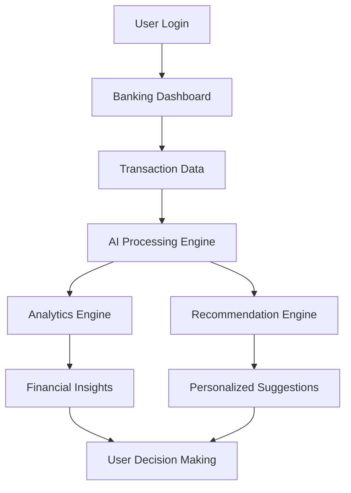

<div align="center">


# 💙 YONO AI
### Intelligent Banking • Wealth Advisory • AI-Powered Finance Ecosystem

<p align="center">

</p>


### 🚀 Reimagining Digital Banking with Artificial Intelligence

</div>

---

# 📌 Overview

**YONO AI** is a next-generation **AI-powered banking and personal finance platform** designed to transform traditional digital banking into an intelligent financial ecosystem.

Unlike conventional banking applications that mainly support transactions, YONO AI acts as a **smart financial companion** that helps users:

- Track spending behavior
- Manage wealth intelligently
- Plan investments
- Monitor savings goals
- Detect risks and fraud
- Receive personalized AI recommendations

This platform bridges the gap between **banking, analytics, automation, and intelligent financial advisory**.

---

# ❗ Problem Statement

Traditional banking apps focus heavily on operations like:

- Balance inquiry  
- Money transfers  
- Bill payments  
- Loan services  
- Account statements  

However, users still struggle with:

❌ Poor financial awareness  
❌ Lack of spending insights  
❌ No personalized investment guidance  
❌ Weak savings discipline  
❌ Limited AI-driven decision support  

There is a strong need for a smarter system that combines **banking + AI + analytics**.

---

# 💡 Proposed Solution

YONO AI solves these challenges by introducing an **intelligent finance ecosystem** that delivers:

✅ AI financial advisor  
✅ Real-time analytics dashboards  
✅ Smart wealth management  
✅ Goal-based savings planning  
✅ Investment tracking  
✅ Personalized financial recommendations  

The platform converts raw financial activity into actionable insights.

---

# ✨ Key Features

## 🧠 AI Financial Advisor
- AI-powered chatbot for personalized finance guidance
- Natural language interaction
- Smart investment suggestions

---

## 📊 Financial Analytics Dashboard
- Spending analysis
- Income vs expenses insights
- Cash flow visualization
- Wealth growth tracking

---

## 💰 Wealth Management
- Portfolio monitoring
- Asset distribution tracking
- Long-term wealth planning

---

## 📈 Investment Monitoring
Track multiple investment products:

- Stocks
- Mutual Funds
- Fixed Deposits
- Insurance Plans

---

## 🎯 Goal-Based Planning
Users can define goals such as:

- Emergency Fund
- Education Savings
- Home Purchase
- Retirement Planning

AI helps optimize savings strategy.

---

## 🔒 Risk & Fraud Detection
- Suspicious transaction alerts
- Financial anomaly detection
- Security-focused monitoring

---

## 📄 Smart Document Management
- Statements
- Financial reports
- Banking documents
- Transaction history

---

# 🏗 Architecture / Process Flow



---

# 🛠 Technology Stack

## Frontend
- React
- TypeScript
- Vite
- TanStack Router
- Tailwind CSS
- Radix UI / ShadCN

## AI / Intelligence
- OpenAI Compatible AI SDK
- Recommendation Engine
- Financial Analytics Models

## Data & Analytics
- Real-time financial datasets
- Predictive analysis
- KPI dashboards

## Deployment
- Modern cloud-ready architecture
- Scalable API integrations

---

# 📂 Core Modules

```bash
src/routes/
│
├── analytics.tsx
├── advisor.tsx
├── wealth.tsx
├── investments.tsx
├── stocks.tsx
├── mutual-funds.tsx
├── fixed-deposits.tsx
├── insurance.tsx
├── planner.tsx
├── goals.tsx
├── documents.tsx
└── chat.tsx
```

---

# 📈 Business Model / Commercial Potential

YONO AI creates value for banks and customers through:

### Revenue Opportunities
- Premium AI advisory subscriptions
- Wealth management services
- Investment recommendations
- Partner financial products
- Banking API integrations

### Market Potential
The global digital banking and AI-finance sector is rapidly expanding due to:

- Increasing fintech adoption
- Rising digital payments
- AI-driven personalization demand
- Data-driven wealth management

YONO AI positions itself strongly in the future of intelligent banking.

---

# 🎯 Future Scope

- Voice-enabled banking assistant  
- Generative AI financial planning  
- Credit risk prediction  
- Hyper-personalized recommendations  
- Advanced fraud detection models  
- Smart loan eligibility scoring  

---

# 🚀 Installation

```bash
git clone https://github.com/nikhilvemulaaa/aura-wealth-tech.git
```

```bash
cd aura-wealth-tech
```

Install dependencies:

```bash
npm install
```

Run locally:

```bash
npm run dev
```

---

# 📸 Screenshots

Add project screenshots here:

- Dashboard UI
- AI Advisor
- Wealth Analytics
- Investment Planner

---

# 👨‍💻 Author

## Nikhil Vemula
AI & Data Analytics Enthusiast  
Passionate about building AI-powered solutions in FinTech, Analytics, and Intelligent Systems.

### Connect With Me
- GitHub: https://github.com/nikhilvemulaaa
- LinkedIn: Add your LinkedIn profile here

---

<div align="center">

## ⭐ If you like this project, consider starring the repository!

### Building the Future of Smart Banking with AI 💙

</div>
